<div align="center">

</div>

```console
ken@github:~$ whoami
Node.js-first software developer.
Backend-heavy by default; front-to-back when the product needs it.
I build web apps, APIs, and mobile apps.

ken@github:~$ cat stack/core
```

<div align="center">


</div>

```console
ken@github:~$ cat stack/mobile
```

<div align="center">


</div>

```console
ken@github:~$ cat stack/also
```

<div align="center">


</div>

```console
ken@github:~$ ./status
```

<div align="center">

</div>
